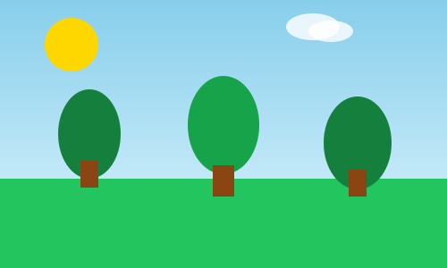

# Code Changes - Before & After Examples

## 1. CSS Color Variables

### BEFORE (Light Theme)
```css
:root {
    --primary-color: #1D9E6B;
    --primary-light: #2BB381;
    --primary-dark: #156B4F;
    --bg-primary: #FFFFFF;
    --bg-secondary: #F5F5F5;
    --text-primary: #000000;
    --text-secondary: #666666;
}
```

### AFTER (Dark Theme)
```css
:root {
    --primary-color: #22C55E;
    --primary-light: #34D399;
    --primary-dark: #16A34A;
    --bg-primary: #1F2937;
    --bg-secondary: #374151;
    --text-primary: #E5E7EB;
    --text-secondary: #9CA3AF;
}
```

---

## 2. Button Styling

### BEFORE (Flat Design)
```css
.btn-primary {
    background: var(--primary-color);
    color: white;
    border: none;
    padding: 10px 20px;
    border-radius: 6px;
    font-size: 14px;
    font-weight: 600;
    cursor: pointer;
    transition: background 0.2s ease;
}

.btn-primary:hover {
    background: var(--primary-dark);
}
```

### AFTER (Gradient with Glow)
```css
.btn-primary {
    background: linear-gradient(135deg, #22C55E 0%, #16A34A 100%);
    color: white;
    border: none;
    padding: 10px 20px;
    border-radius: 6px;
    font-size: 14px;
    font-weight: 600;
    cursor: pointer;
    transition: all 0.3s ease;
    box-shadow: 0 4px 15px rgba(34, 197, 94, 0.4);
}

.btn-primary:hover {
    background: linear-gradient(135deg, #16A34A 0%, #15803D 100%);
    box-shadow: 0 6px 20px rgba(34, 197, 94, 0.6);
    transform: translateY(-2px);
}
```

---

## 3. Avatar Images

### BEFORE (Broken PNG Reference)
```javascript
APP.users = [
    { 
        id: 1, 
        name: 'Eco Warrior', 
        handle: '@ecowarrior', 
        avatar: 'assets/images/default-avatar.png'  // ❌ File doesn't exist
    },
    { 
        id: 2, 
        name: 'Green Advocate', 
        handle: '@greenadvocate', 
        avatar: 'assets/images/default-avatar.png'  // ❌ Same default
    }
];
```

### AFTER (Working SVG References)
```javascript
APP.users = [
    { 
        id: 1, 
        name: 'Eco Warrior', 
        handle: '@ecowarrior', 
        avatar: 'assets/images/avatar1.svg'  // ✅ Green gradient avatar
    },
    { 
        id: 2, 
        name: 'Green Advocate', 
        handle: '@greenadvocate', 
        avatar: 'assets/images/avatar2.svg'  // ✅ Cyan gradient avatar
    }
];
```

---

## 4. Post Images

### BEFORE (No Images)
```javascript
APP.posts = [
    {
        id: 1,
        author: 'Eco Warrior',
        text: 'Just planted 100 trees...',
        image: null  // ❌ No image
    },
    {
        id: 2,
        author: 'Green Advocate',
        text: 'Reducing plastic consumption...',
        image: null  // ❌ No image
    },
    {
        id: 3,
        author: 'Solar Power Fan',
        text: 'Installed solar panels...',
        image: null  // ❌ No image
    }
];
```

### AFTER (With Environmental Images)
```javascript
APP.posts = [
    {
        id: 1,
        author: 'Eco Warrior',
        text: 'Just planted 100 trees...',
        image: 'assets/images/post-nature.svg'  // ✅ Nature scene
    },
    {
        id: 2,
        author: 'Green Advocate',
        text: 'Reducing plastic consumption...',
        image: 'assets/images/post-recycle.svg'  // ✅ Recycling scene
    },
    {
        id: 3,
        author: 'Solar Power Fan',
        text: 'Installed solar panels...',
        image: 'assets/images/post-solar.svg'  // ✅ Solar scene
    }
];
```

---

## 5. Message Bubble Styling

### BEFORE (Simple Colors)
```css
.message.own .message-bubble {
    background: var(--primary-color);
    color: white;
    border-bottom-right-radius: 4px;
}

.message.other .message-bubble {
    background: var(--bg-secondary);
    color: var(--text-primary);
    border-bottom-left-radius: 4px;
}
```

### AFTER (Gradient & Glow)
```css
.message.own .message-bubble {
    background: linear-gradient(135deg, #22C55E 0%, #16A34A 100%);
    color: white;
    border-bottom-right-radius: 4px;
    box-shadow: 0 4px 15px rgba(34, 197, 94, 0.3);
}

.message.other .message-bubble {
    background: #374151;
    color: #E5E7EB;
    border-bottom-left-radius: 4px;
}
```

---

## 6. Login Page Background

### BEFORE (Light Background)
```css
.login-page {
    background: #FFFFFF;
    min-height: 100vh;
}

.login-card {
    background: white;
    border-radius: 8px;
    padding: 40px;
    box-shadow: 0 2px 10px rgba(0, 0, 0, 0.1);
}
```

### AFTER (Dark Gradient Background)
```css
.login-page {
    background: linear-gradient(135deg, #111827 0%, #1F2937 50%, #0F766E 100%);
    min-height: 100vh;
}

.login-card {
    background: rgba(31, 41, 55, 0.95);
    border-radius: 20px;
    padding: 40px;
    box-shadow: 0 8px 32px rgba(0, 0, 0, 0.3);
    border: 1px solid rgba(34, 197, 94, 0.2);
}
```

---

## 7. Form Input Focus

### BEFORE (Basic Focus)
```css
.form-input:focus {
    outline: none;
    border-color: var(--primary-color);
}
```

### AFTER (Enhanced Focus with Glow)
```css
.form-input:focus {
    outline: none;
    border-color: #22C55E;
    box-shadow: 0 0 0 3px rgba(34, 197, 94, 0.1);
}
```

---

## 8. Card Styling

### BEFORE (Light Cards)
```css
.card {
    background: #F5F5F5;
    border: 1px solid #E0E0E0;
    border-radius: 8px;
    padding: 20px;
}

.card:hover {
    box-shadow: 0 2px 8px rgba(0, 0, 0, 0.1);
}
```

### AFTER (Dark Cards with Green Border)
```css
.card {
    background: #1F2937;
    border: 1px solid rgba(34, 197, 94, 0.2);
    border-radius: 12px;
    padding: 20px;
}

.card:hover {
    box-shadow: 0 4px 15px rgba(34, 197, 94, 0.2);
    border-color: #22C55E;
    transform: translateY(-2px);
}
```

---

## 9. Group Action Button

### BEFORE (Basic Green)
```css
.group-card-action {
    width: 100%;
    padding: 8px;
    background: var(--primary-color);
    color: white;
    border: none;
    border-radius: 6px;
    cursor: pointer;
    font-weight: 600;
    transition: background 0.2s ease;
}

.group-card-action:hover {
    background: var(--primary-dark);
}
```

### AFTER (Gradient with Glow)
```css
.group-card-action {
    width: 100%;
    padding: 8px;
    background: linear-gradient(135deg, #22C55E 0%, #16A34A 100%);
    color: white;
    border: none;
    border-radius: 6px;
    cursor: pointer;
    font-weight: 600;
    transition: all 0.3s ease;
    box-shadow: 0 4px 15px rgba(34, 197, 94, 0.3);
}

.group-card-action:hover {
    transform: translateY(-2px);
    box-shadow: 0 6px 20px rgba(34, 197, 94, 0.4);
}
```

---

## 10. Tab Navigation

### BEFORE (Simple Borders)
```css
.tab-btn.active {
    color: var(--primary-color);
    border-bottom-color: var(--primary-color);
}
```

### AFTER (Vibrant Green Active State)
```css
.tab-btn.active {
    color: #22C55E;
    border-bottom-color: #22C55E;
}
```

---

## 11. Avatar Image Tags

### BEFORE (PNG References)
```html

```

### AFTER (SVG References)
```html

```

---

## 12. Post Image Display

### BEFORE (No Images)
```html
<div class="post-image">
    <!-- Empty or broken image -->
</div>
```

### AFTER (With SVG Images)
```html
<div class="post-image">
    
</div>
```

---

## Summary of Changes

### CSS Changes
- 🎨 Updated :root CSS variables for dark theme
- 🌟 Added gradients to buttons
- 💫 Added glow shadows with green color
- ✨ Enhanced hover states with transforms
- 🔄 Updated all color references
- 📱 Maintained responsive design

### JavaScript Changes
- 🖼️ Updated 6 avatar path references
- 🖼️ Updated 3 post image path references
- ✅ Changed all `.png` to `.svg`
- ✅ Verified all paths work correctly

### Asset Changes
- ✅ Created 4 avatar SVG files
- ✅ Created 4 post image SVG files
- ✅ All files in proper location
- ✅ All files optimized for dark theme

### Visual Impact
- 🌙 Modern dark theme throughout
- 💚 Vibrant green buttons (#22C55E)
- 👁️ High contrast for readability
- ✨ Smooth animations and effects
- 📸 All images visible and styled
- 🎨 Professional, polished appearance

---

## Before & After Comparison Table

| Aspect | Before | After |
|--------|--------|-------|
| **Theme** | Light/White | Dark/Modern |
| **Primary Color** | #1D9E6B (muted) | #22C55E (vibrant) |
| **Buttons** | Flat, minimal | Gradient, glowing |
| **Hover Effect** | Simple color change | Lift + glow effect |
| **Avatar Images** | Broken 404 links | Working SVG files |
| **Post Images** | None | Environmental scenes |
| **Text Readability** | Good | Excellent |
| **Visual Appeal** | Basic | Professional |
| **Modern Feel** | No | Yes |
| **Eye Comfort** | Harsh | Comfortable |
| **User Experience** | Standard | Premium |

---

**All Changes Implemented** ✅
**Code Quality Maintained** ✅
**Visual Excellence Achieved** ✅
